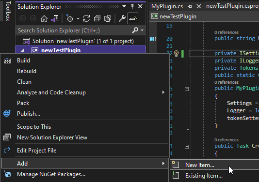

# Creating plugins

::: tip
This is written in a tutorial-like style. Skip to next sections for raw documentation.
:::

## Basic template

Create new .net standard project in Visual Studio or using command line:

```sh
dotnet new classlib -f netstandard2.1
```

Open csproj file using Visual Studio and double click on your project name to open its configuration. Inside of it add reference to newest [StreamCompanionTypes nuget package](https://www.nuget.org/packages/StreamCompanionTypes/):
@[code xml{5,7-9}](./apiExamples/plugin/1.csproj)

Rename `Class1` that got created by default to some meaningful name(`MyPlugin`) and implement base `IPlugin` interface:
@[code csharp](./apiExamples/plugin/1.cs)
At this point this project could get compiled and ran by StreamCompanion, but what is the point if it does nothing? Lets make it log something at startup:
@[code csharp{2,3,13-16}](./apiExamples/plugin/2.cs)
Our plugin now requests `ILogger` **Service** at startup from StreamCompanion and uses it to log our message.  
Lets see it in action: Build whole solution, copy everything from `bin\Debug\netstandard2.1` in solution folder to StreamCompanion `plugins` folder. It should be loaded along with log message logged.  
That's cool and all but this copying and manual running will get old and annoying really quick - so we need to automate things a bit.

## Testing enviroment

Create an empty folder with 2 directories inside:

* `newTestPlugin` - folder with your plugin project, its name doesn't matter.
* `SCInstall` - folder with installed/portable SC. Existing installation can be just copied over.

Add `OutputPath` to your project configuration:
@[code xml{6}](./apiExamples/plugin/2.csproj)
Inside your solution folder create `Properties` folder with `launchSettings.json` inside and populate it with:
@[code json{3}](./apiExamples/plugin/launchSettings.json)
Replace `newTestPlugin` with name of your project(not class name!)  

With that done, your plugin can be now easily tested and debugged without ever leaving Visual Studio - Start debugging (Debug->Start debugging at the top menu) to test any changes.

::: tip
Project with everything mentioned so far can be found [here](../../misc/PluginProject.zip) and can be used as a template. Remember to change namespace and plugin class name!
:::

## Interacting with events

`CreateTokensAsync`(from [`ITokensSource`](#itokenssource)) & `SetNewMapAsync`(from [`IMapDataConsumer`](#imapdataconsumer)) are 2 hooks you'll most likely want to use. Code below demonstrates how to:

* request multiple services from SC and store these for later use (lines 19-27)
* create&update tokens (lines 31-41).
* store persistent settings between runs (lines 22 and 38).
* use final event data(tokens/map search result) (lines 43-56).

@[code csharp](./apiExamples/plugin/3.cs)

For more understanding when these methods are executed proceed to next section.

## Creating settings GUI

In order to create user interface for settings, we will have to do few small modifications to the project. Namely:

* Use net5.0-windows instead of net standard
* Specify that we want to use winForms, which is current way of adding settings GUI

@[code xml{3,6}](./apiExamples/plugin/4.csproj)

Create new UserControl in the project by right clicking on project name, Add & New item. From the list select UserControl and name it. We'll name it `SettingsUserControl` for this plugin.  

  

Now that we have UserControl in our plugin lets provide it to StreamCompanion by implementing `ISettingsSource`:

@[code csharp{8,14,15,21-32}](./apiExamples/plugin/4.cs)
First we have to provide `SettingGroup` with will be used as group name in settings tabs. As for 2 methods:

* `GetUiSettings()` - This should be used for initalizing your userControl. Every time user navigates to your `SettingGroup` this will get called.
* `Free()` - Destroy UserControl instance and do any other necessary cleanup work. Every time user navigates away from your `SettingGroup` this will get called.

With that done it's now up to you, to decide how you want to handle/design your UserControl. I'd suggest to either:

* Pass `ISettings` instance to user control and modify settings inside, [Example](https://github.com/Piotrekol/StreamCompanion/blob/3b787fa1f8853384408a1cde40ddbcd7674aeb57/plugins/ModsHandler/ModParser.cs#L47-L59).
* Use events to pop any user setting changes back to main plugin class and handle it there, [Example](https://github.com/Piotrekol/StreamCompanion/blob/e099ee0d6a75e56a0c1048c6640095a9aef2d2c0/plugins/Gamma/GammaPlugin.cs#L77-L90).
